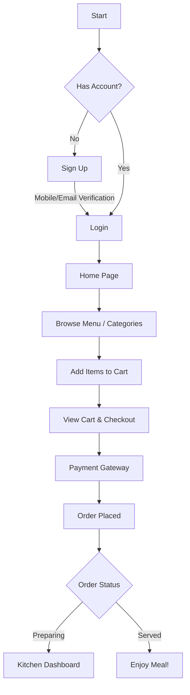
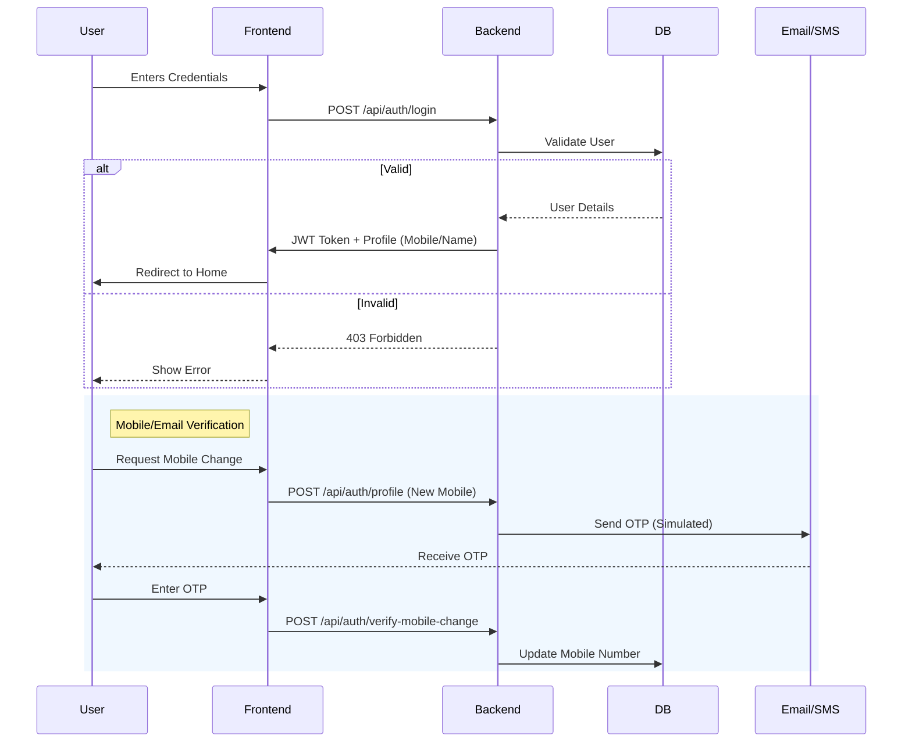
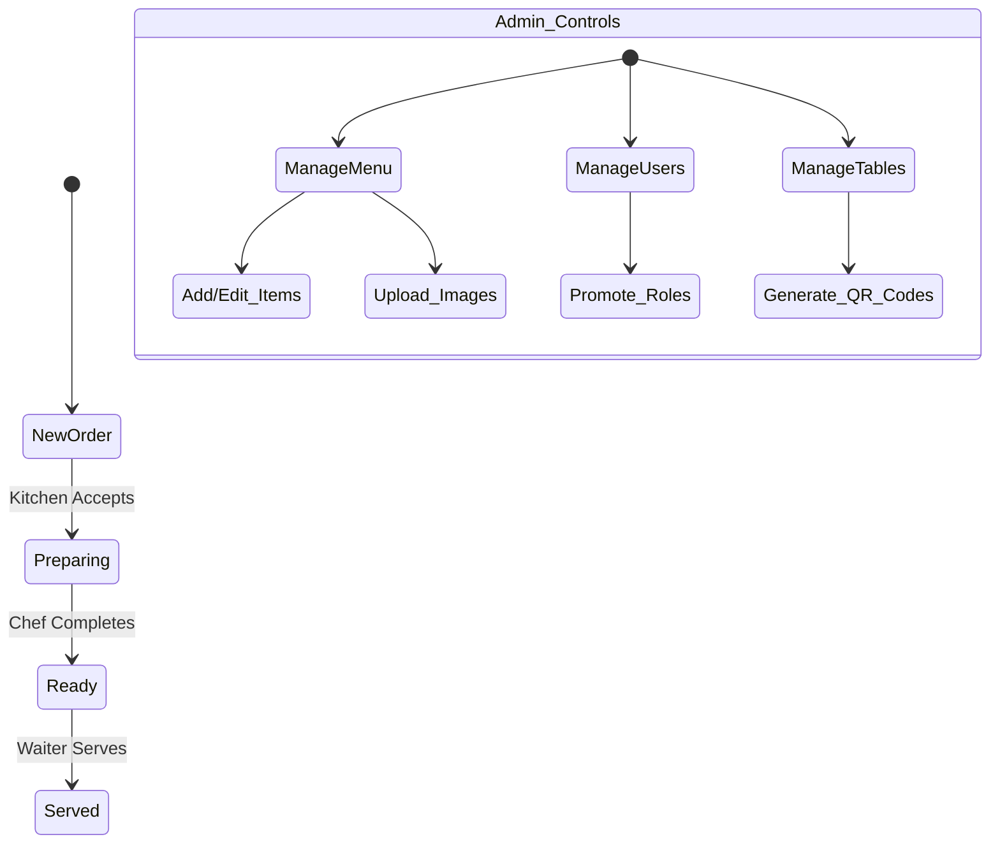

# Love, Rosie - Smart Restaurant System 🌹

A modern, full-stack restaurant management system built with **Spring Boot** and **React**.

## 🚀 Application Flow

### 👤 User Journey


### 🔐 Authentication & Security Process


### 👨‍🍳 Kitchen & Admin Workflow


## 🛠️ Technology Stack

*   **Frontend**: React.js, Context API, CSS3 (Modern/Glassmorphism)
*   **Backend**: Java Spring Boot, Hibernate, Spring Security (JWT)
*   **Database**: MySQL (Dev) / TiDB (Prod)
*   **Tools**: Maven, NPM, Git

## 🏃‍♂️ Quick Start

### Backend
```bash
cd backend/smart-restaurant-backend
mvn clean spring-boot:run
```

### Frontend
```bash
cd frontend
npm install
npm start
```

## 📱 Features
*   **Mobile Number Verification**: Secure OTP-based verification for signups and profile updates.
*   **Real-time Order Tracking**: Separation of concerns between User, Admin, and Kitchen views.
*   **Dynamic Menu**: Admin-managed menu with categories and image uploads.
*   **Responsive UI**: Optimized for mobile and desktop experiences.
