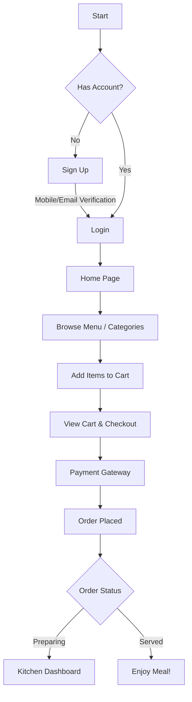
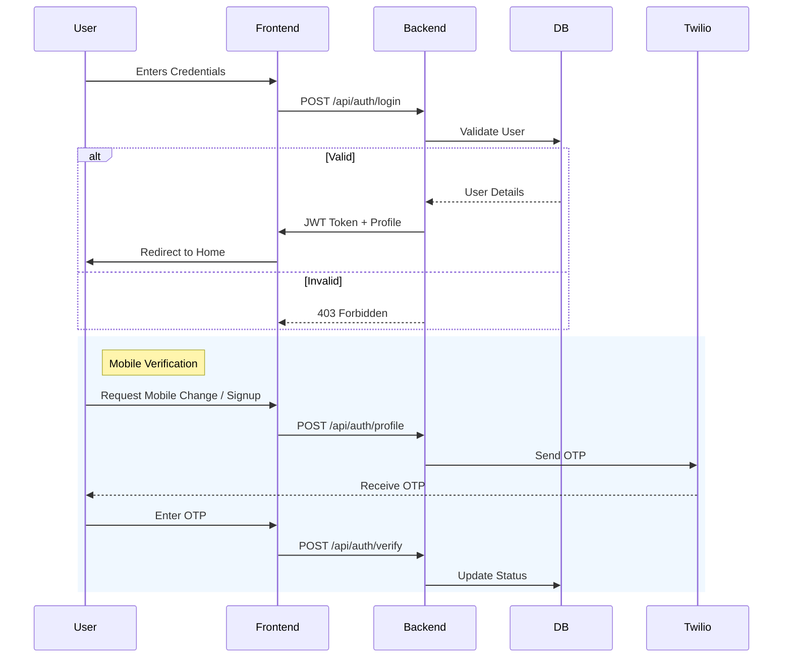

# 🌹 Love, Rosie - Smart Restaurant System

> **A modern, full-stack restaurant management solution designed to streamline operations from the kitchen to the customer's table.**

Built with **Spring Boot 3** and **React 19**, this system offers a seamless experience for diners, efficient tools for staff, and powerful analytics for administrators.

---

## 🚀 Features

### 👤 For Customers
*   **Secure Authentication**: Sign up and log in securely. Supports **Mobile Number Verification** using OTP (via Twilio).
*   **Dynamic Menu**: Browse a visually rich menu with categories, detailed descriptions, and images.
*   **Smart Cart & Checkout**: Easily add items, review orders, and proceed to checkout.
*   **Order History**: Track past orders and re-order favorites with ease.
*   **Profile Management**: Update personal details and manage saved addresses.
*   **Real-time Status**: Track order status from "Preparing" to "Served".

### 👑 For Administrators
*   **Comprehensive Dashboard**: View key metrics at a glance - Total Orders, Revenue, and Active Tables.
*   **Advanced Analytics**:
    *   **Revenue Timeline**: Visual graphs showing income trends.
    *   **Peak Hours**: Identify busiest times to optimize staffing.
    *   **Most Ordered Items**: Track popularity of dishes.
*   **Menu Management**:
    *   Add, edit, or delete categories and items.
    *   Upload and manage food images.
*   **Table Management**:
    *   Manage restaurant layout and table availability.
    *   **QR Code Generation**: Generate unique QR codes for each table for easy ordering.
*   **Event & Hall Booking**: Manage reservations for special events and party halls.
*   **Staff Management**: Manage staff roles and permissions.

### 👨‍🍳 For Kitchen Staff
*   **Live Kitchen Dashboard**: Real-time view of incoming orders.
*   **Order Workflow**: tailored interface to mark items as "Preparing" or "Ready" to notify waitstaff.

---

## 🛠️ Technology Stack

### Frontend
*   **Framework**: React 19
*   **Routing**: React Router DOM v7
*   **State Management**: React Context API
*   **Styling**: CSS3 (Glassmorphism & Modern UI), standard CSS Modules
*   **HTTP Client**: Axios
*   **Visualization**: Chart.js, React-Chartjs-2
*   **Utilities**: React Icons, QR Code Generator

### Backend
*   **Framework**: Spring Boot 3.2.0 (Java 17)
*   **Security**: Spring Security, JWT (JSON Web Tokens)
*   **Database**: MySQL (Development), TiDB (Production ready)
*   **ORM**: Hibernate / Spring Data JPA
*   **Notifications**: Twilio SDK (SMS/OTP)
*   **Build Tool**: Maven

### DevOps & Tools
*   **Containerization**: Docker
*   **Version Control**: Git

---

## 🏗️ Architecture & Flows

### 🛒 User Journey


### 🔐 Authentication Flow


---

## 🏃‍♂️ Getting Started

### Prerequisites
*   **Java 17** SDK
*   **Node.js** (v18 or higher)
*   **MySQL** Database

### 1️⃣ Backend Setup
1.  Navigate to the backend directory:
    ```bash
    cd backend/smart-restaurant-backend
    ```
2.  Configure database in `src/main/resources/application.properties`:
    ```properties
    spring.datasource.url=jdbc:mysql://localhost:3306/smart_restaurant
    spring.datasource.username=root
    spring.datasource.password=your_password
    ```
3.  Run the application:
    ```bash
    mvn spring-boot:run
    ```
    The backend will start on `http://localhost:8080`.

### 2️⃣ Frontend Setup
1.  Navigate to the frontend directory:
    ```bash
    cd frontend
    ```
2.  Install dependencies:
    ```bash
    npm install
    ```
3.  Start the development server:
    ```bash
    npm start
    ```
     The app will open at `http://localhost:3000`.

---

## 📂 Project Structure

```
smart-restaurant-system/
├── backend/
│   └── smart-restaurant-backend/
│       ├── src/main/java/com/restaurant/backend/
│       │   ├── config/       # Security & App Config
│       │   ├── order/        # Order Management, Analytics
│       │   ├── menu/         # Menu & Category Logic
│       │   ├── reservation/  # Events & Hall Booking
│       │   ├── user/         # User & Auth Logic
│       │   └── kitchen/      # Kitchen Workflow
│       └── pom.xml
├── frontend/
│   ├── src/
│   │   ├── components/   # Reusable UI Components
│   │   ├── pages/        # Application Pages (Admin, User, etc.)
│   │   ├── context/      # Global State (Auth, Cart)
│   │   └── App.js        # Main Routing
│   └── package.json
└── README.md
```

## 🤝 Contributing
Contributions are welcome! Please fork the repository and submit a pull request for any enhancements.

---
**Developed with ❤️ by Kiruthik**
